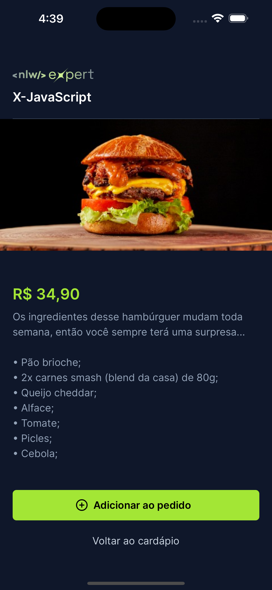

# Orders

> Project desenvolvido durante o evento NLW Expert (Trilha React Native) da Rocketseat.

## Pré-visualização

| Home | Produto | Pedido |
|---|---|---|
|  |  |  |

## Material complementar

- [NLW 14: Expert - Trilha React Native](https://efficient-sloth-d85.notion.site/NLW-14-Expert-9e11ff472de64b08a5f9e277a20c3ecc)
- [Ambiente React Native](https://react-native.rocketseat.dev/)
- [Wallpapers](https://drive.google.com/drive/folders/1bdX5SIrw6MBBqBkZgryc4H_omPQhuPx-)
- [Expo](https://expo.dev/)
- [TailwindCSS](https://tailwindcss.com/)
- [NativeWind](https://www.nativewind.dev/)
- [Zustand](https://docs.pmnd.rs/zustand/getting-started/introduction)
- [Gerenciamento de Estados no React Native](https://efficient-sloth-d85.notion.site/Gerenciamento-de-Estados-no-React-Native-1d6aa529921643faaf9379f2b588bb01)
- [react-native-keyboard-aware-scroll-view](https://www.npmjs.com/package/react-native-keyboard-aware-scroll-view)
- [React Native Async Storage](https://www.npmjs.com/package/@react-native-async-storage/async-storage)
